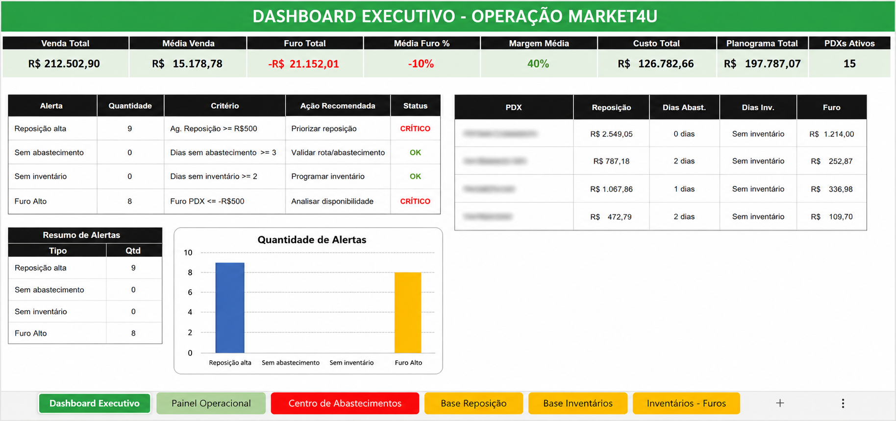

# 📊 Central Operacional Market4U

## 🎯 Objetivo

Desenvolver uma central operacional para monitoramento dos principais indicadores da operação, permitindo maior controle, visibilidade e tomada de decisão baseada em dados.

---

## 🚨 Problema

As informações operacionais estavam distribuídas em diferentes planilhas e controles, dificultando o acompanhamento dos indicadores e a identificação de oportunidades de melhoria.

---

## ✅ Solução

Desenvolvimento de um Dashboard em Power BI para consolidar os principais indicadores operacionais em uma única visão estratégica.

---

## 🛠️ Ferramentas Utilizadas

- Power BI
- Excel
- Power Query
- DAX

---

## 📈 Indicadores Monitorados

- Total de PDXs Ativos
- Valor Total de Furo
- Média de Furo %
- Inventários
- Abastecimentos
- Vendas
- Performance Operacional

---

## 🖼️ Dashboard

---

## 🎯 Benefícios

- Centralização das informações
- Redução do tempo de análise
- Maior visibilidade operacional
- Apoio à tomada de decisão

---

## 🚀 Status

Projeto em evolução contínua.
